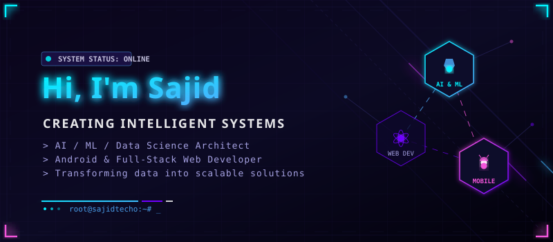
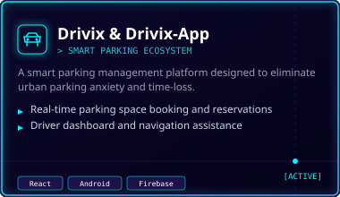
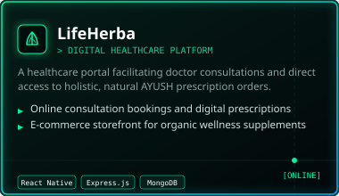
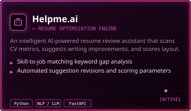
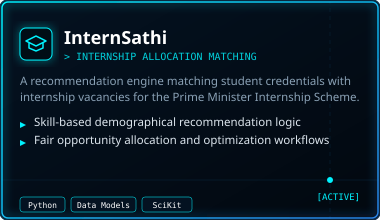

<p align="center">
  <a href="https://portfolio-kappa-beryl-49.vercel.app/">
    
  </a>
</p>

<p align="center">
  <a href="https://github.com/sajidtecho"></a>
  <a href="https://portfolio-kappa-beryl-49.vercel.app/"></a>
</p>

---

## ⚡ About Me

```json
{
  "name": "Sajid Ahmad",
  "role": "AI & ML Enthusiast | Full-Stack App Developer",
  "mission": "To transform complex datasets into intelligent, scalable, and user-centric software solutions",
  "current_focus": [
    "Building advanced recommendation systems",
    "Architecting neural networks & predictive models",
    "Optimizing data matching algorithms"
  ]
}
```

* 💡 Passionate about building **futuristic tech solutions** that combine **AI, Machine Learning, and Data Science** with clean, scalable app development.
* 📱 Skilled in **Android Studio (Kotlin/Java)** and **React (Web Development)** to build seamless cross-platform interfaces.
* 🎓 Developed the **InternSathi & InterSetu** recommendation engines designed to optimize internship matching dynamics.

---

## 🛠️ Tech & Tools

<table align="center" width="100%" border="0" cellspacing="0" cellpadding="5">
  <tr>
    <td width="50%" valign="top">
      <h4>🧠 Artificial Intelligence &amp; Data Science</h4>
      <a href="https://www.python.org/"></a>
      <a href="https://www.tensorflow.org/"></a>
      <a href="https://scikit-learn.org/"></a>
      <a href="https://pandas.pydata.org/"></a>
    </td>
    <td width="50%" valign="top">
      <h4>🌐 Frontend &amp; Mobile Client Development</h4>
      <a href="https://react.dev/"></a>
      <a href="https://developer.android.com/"></a>
      <a href="https://kotlinlang.org/"></a>
      <a href="https://www.oracle.com/java/"></a>
    </td>
  </tr>
  <tr>
    <td width="50%" valign="top">
      <h4>⚙️ Backend &amp; Database Systems</h4>
      <a href="https://nodejs.org/"></a>
      <a href="https://expressjs.com/"></a>
      <a href="https://www.mongodb.com/"></a>
      <a href="https://firebase.google.com/"></a>
    </td>
    <td width="50%" valign="top">
      <h4>🚀 Interactive Tech Stack</h4>
      
      
      
    </td>
  </tr>
</table>

---

## 🚀 Projects Ledger

Here are the key projects I've built, exploring both client interface elegance and machine learning pipelines:

<p align="center">
  <a href="https://github.com/sajidtecho/Drivix" target="_blank">
    
  </a>
  <a href="https://portfolio-kappa-beryl-49.vercel.app/" target="_blank">
    
  </a>
</p>
<p align="center">
  <a href="https://github.com/sajidtecho/Helpme.ai" target="_blank">
    
  </a>
  <a href="https://github.com/sajidtecho/InternSathi--Smart-internship-recommendation-Engine-Prime-Minister-Internship-Scheme-" target="_blank">
    
  </a>
</p>

---

## 📊 Developer Metrics & Stats

<p align="center">
  
  
</p>

---

## 🌐 Get in Touch

<p align="center">
  <a href="https://github.com/sajidtecho">
    
  </a>
  <a href="https://www.linkedin.com/in/sajid-ahmad-er/">
    
  </a>
</p>

<p align="center">
  <i>✨ “Transforming ideas into intelligent, data‑driven solutions that inspire progress.”</i>
</p>
